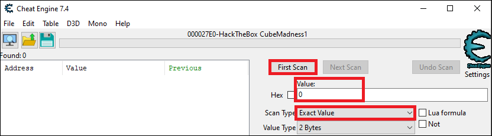

# Cheat Engine

Avant de commencer, il faut choisir le bon processus à analyser :&#x20;

.png>)

### Modifier une valeur numérique dans un jeu

* Faire un premier scan avec la valeur initial présente dans le jeu :&#x20;

* Modifier la valeur dans le jeu et faire un nouveau scan (répéter cette opération afin de réduire les adresses mémoire possible) :&#x20;

.png>)

* Une fois qu'il reste que peu d'adresse dans la liste de gauche, effectuer un clic droit sur celles-ci, puis cliquer sur "_Add selected addresses to the addresslist_".
* Une fois dans cette liste, il est possible de modifier la valeur correspondant à l'adresse. Cela sera répercuté dans le jeu.

.png>)

### Identifier une chaine de caractère dans un jeu

.png>)
