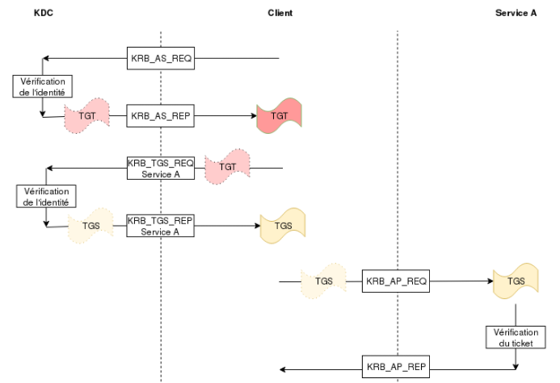

# Active Directory

### Définitions

* Ticket TGT : représentant les utilisateurs – ils permettent d’obtenir des Tickets de services.
* Ticket de service (TGS) : ils permettent d’accéder à une ressource sur un serveur précis.
* Service : C'est une fonctionnalité, un logiciel, quelque chose qui peut être utilisé par d’autres membres de l’AD.
* SPN : Identifiant de service (`type_du_service/hostname:port/nom_arbitraire`)

### Kerberos

